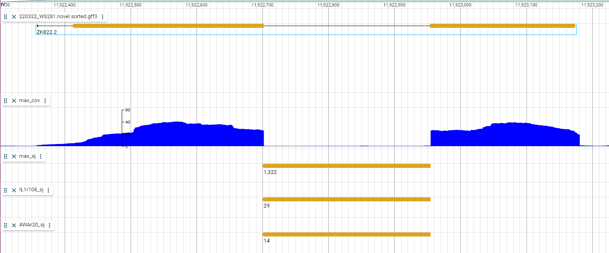
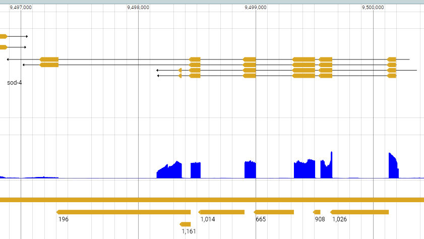
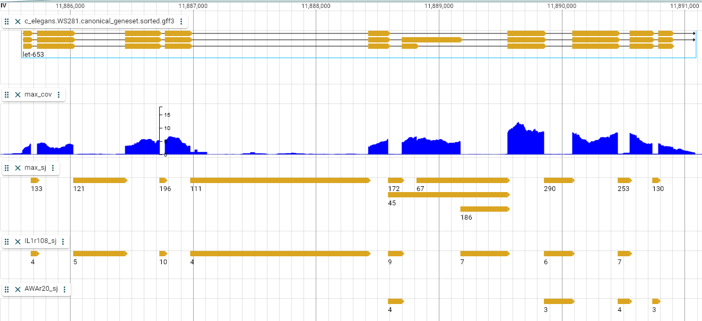

# Check data for Deep Learning


```{r message=FALSE}
library(tidyverse)
library(testthat)
library(Biostrings)

# functions
plot_splice_graph <- function(seg_coords){
  seg_coords |>
    mutate(transcript_id = factor(transcript_id),
           y = as.integer(transcript_id)) |>
    ggplot() +
    theme_classic() +
    geom_rect(aes(xmin = segment_start,
                  xmax = segment_end,
                  ymin = y,
                  ymax = y + 0.5,
                  fill = type),
              alpha = .5)
}

collapse <- function(dna){
  stopifnot(class(dna) %in% c("DNAStringSet"))
  do.call(Biostrings::xscat, dna)
}
```

Load the main datasets

```{r}
all_gene_sequences <- readDNAStringSet("../data/intermediates_for_DL/220920_gene_sequences.fa.gz")


stopifnot(all.equal(class(all_gene_sequences),
                    "DNAStringSet",
                    check.attributes = FALSE))


main_transcript_per_neuron <- read_tsv("../data/intermediates_for_DL/220920_main_transcript_per_neuron.tsv",
                                       show_col_types = FALSE)

expect_identical(ncol(main_transcript_per_neuron),
                 3L)

expect_identical(colnames(main_transcript_per_neuron),
                 c("gene_id", "neuron_id","main_transcript"))

```


#  ZK822.2 WBGene00014090

Simple structure, on the "-" strand, 




## Segments coordinates file

Coordinates file integrity:

```{r}
segments_coords <- read_tsv("../data/intermediates_for_DL/220919_segments_coordinates/WBGene00014090.tsv",show_col_types = FALSE)

expect_identical(ncol(segments_coords),
                 6L)

expect_identical(colnames(segments_coords),
                 c("gene_id", "transcript_id","segment_start","segment_end",
                   "type","gene_length"))

```


Check that correct exon-intron boundaries visually:

```{r}
plot_splice_graph(segments_coords)
```


Check that values exactly match expectations.

```{r}
segments_coords_manual <- tribble(
         ~gene_id,~transcript_id,~segment_start,~segment_end,   ~type,~gene_length,
 "WBGene00014090",   "ZK822.2.1",      11922955,    11923174,  "exon",         817,
 "WBGene00014090",   "ZK822.2.1",      11922702,    11922954,"intron",         817,
 "WBGene00014090",   "ZK822.2.1",      11922358,    11922701,  "exon",         817
) |>
  mutate(segment_start2 = 11923174 - segment_end + 1,
         segment_end2 = 11923174 - segment_start + 1) |>
  select(gene_id, transcript_id,
         segment_start = segment_start2,
         segment_end = segment_end2,
         type, gene_length)

# use as_tibble to strip the readr attributes
expect_identical(as_tibble(segments_coords),
                 as_tibble(segments_coords_manual))


```


## Check sequence


Whole gene

```{r}
zk_gene <- readDNAStringSet("data_for_validating/ZK822-2-1_gene.fa")
zk_gene[[1]]

all_gene_sequences[["WBGene00014090"]]

stopifnot(all.equal(zk_gene[[1]],
                    all_gene_sequences[["WBGene00014090"]],
                    check.attributes = FALSE))

```

After splicing (only the exons)

```{r}
zk_spliced <- readDNAStringSet("data_for_validating/spliced_ZK822-2-1.fa")
zk_spliced[[1]]


zk_spliced_from_exon_coords <- all_gene_sequences[["WBGene00014090"]] |> 
  extractAt(IRanges(start = segments_coords$segment_start[segments_coords$type == "exon"],
                    end = segments_coords$segment_end[segments_coords$type == "exon"])) |>
  collapse()

zk_spliced_from_exon_coords


stopifnot(all.equal(zk_spliced[[1]],
                    zk_spliced_from_exon_coords))
```

Check the exact sequence of each segment:

```{r}
segment_sequences <- all_gene_sequences[["WBGene00014090"]] |> 
  extractAt(IRanges(start = segments_coords$segment_start,
                    end = segments_coords$segment_end))

zk_segments_sequences <- readDNAStringSet("data_for_validating/ZK_segments_sequences.fa") |>
  setNames(NULL)

all.equal(segment_sequences,
          zk_segments_sequences,
          check.attributes = FALSE)

```


## Check main transcript

Single transcript.

```{r}
zk_main_tx <- main_transcript_per_neuron |>
  filter(gene_id == "WBGene00014090")

# this gene should be expressed in PVC, PVW, RIS, maybe others
stopifnot(all(c("PVC","RIS") %in% zk_main_tx$neuron_id))

# single transcript
stopifnot(all(zk_main_tx$main_transcript == "ZK822.2.1"))


```


#  sod-4 WBGene00004933

More complex structure, 2 isoforms with 2 transcripts each, on the "-" strand, 




## Segments coordinates file

Coordinates file integrity:

```{r}
segments_coords <- read_tsv("../data/intermediates_for_DL/220919_segments_coordinates/WBGene00004933.tsv",show_col_types = FALSE)

expect_identical(ncol(segments_coords),
                 6L)

expect_identical(colnames(segments_coords),
                 c("gene_id", "transcript_id","segment_start","segment_end",
                   "type","gene_length"))

```


Check that correct exon-intron boundaries visually:

```{r}
plot_splice_graph(segments_coords)
```


Check that values roughly match expectations. Here not hard-coding each value as there are too many, only checking that total numbers are correct.

```{r}

expect_identical(nrow(segments_coords),
                 48L)


expect_identical(table(segments_coords$transcript_id) |>
                   as.numeric(),
                 c(11, 13, 11, 13))

expect_identical(table(segments_coords$transcript_id) |>
                   names(),
                 c("F55H2.1a.1", "F55H2.1a.2",
                   "F55H2.1b.1", "F55H2.1b.2"))


```


## Check sequence


Whole gene

```{r}
seq_gene <- readDNAStringSet("data_for_validating/sod4_gene.fa")
seq_gene[[1]]

all_gene_sequences[["WBGene00004933"]]

stopifnot(all.equal(seq_gene[[1]],
                    all_gene_sequences[["WBGene00004933"]],
                    check.attributes = FALSE))

```


After splicing (only the exons)

```{r}

## transcript a.1
spliced_isof_a <- readDNAStringSet("data_for_validating/spliced_sod4-a-1.fa")
spliced_isof_a[[1]]


exon_lines <- segments_coords$type == "exon" &
  segments_coords$transcript_id == "F55H2.1a.1"
isof_a_from_exons <- all_gene_sequences[["WBGene00004933"]] |> 
  extractAt(IRanges(start = segments_coords$segment_start[exon_lines],
                    end = segments_coords$segment_end[exon_lines])) |>
  collapse()


stopifnot(all.equal(spliced_isof_a[[1]],
                    isof_a_from_exons))


## Isoform B
spliced_isof_b <- readDNAStringSet("data_for_validating/spliced_sod4-b-2.fa")
spliced_isof_b[[1]]


exon_lines <- segments_coords$type == "exon" &
  segments_coords$transcript_id == "F55H2.1b.2"
isof_b_from_exons <- all_gene_sequences[["WBGene00004933"]] |> 
  extractAt(IRanges(start = segments_coords$segment_start[exon_lines],
                    end = segments_coords$segment_end[exon_lines])) |>
  collapse()

isof_b_from_exons


stopifnot(all.equal(spliced_isof_b[[1]],
                    isof_b_from_exons))


```


Check the exact sequence of each segment in a.2:

```{r}

segments_from_tx_a2 <- segments_coords$transcript_id == "F55H2.1a.2"
segment_sequences <- all_gene_sequences[["WBGene00004933"]] |>
  extractAt(IRanges(start = segments_coords$segment_start[segments_from_tx_a2],
                    end = segments_coords$segment_end[segments_from_tx_a2]))

sod4a2_seg_seq <- readDNAStringSet("data_for_validating/sod4a2_segments_sequences.fa") |>
  setNames(NULL)

all.equal(segment_sequences,
          sod4a2_seg_seq,
          check.attributes = FALSE)

```


## Check main transcript


```{r}
sod4_main_tx <- main_transcript_per_neuron |>
  filter(gene_id == "WBGene00004933")

# this gene should be expressed in VB and DB
stopifnot(all(c("VB") %in% sod4_main_tx$neuron_id))

# transcript a1 largely dominant in VB
stopifnot(all(
  sod4_main_tx$main_transcript[sod4_main_tx$neuron_id == "VB"] == "F55H2.1a.1"))

```


# let-653 WBGene00002827

More complex locus, but low to nonexistent expression in neurons.




## Segments coordinates file

Coordinates file integrity:

```{r}
segments_coords <- read_tsv("../data/intermediates_for_DL/220919_segments_coordinates/WBGene00002827.tsv",show_col_types = FALSE)

expect_identical(ncol(segments_coords),
                 6L)

expect_identical(colnames(segments_coords),
                 c("gene_id", "transcript_id","segment_start","segment_end",
                   "type","gene_length"))

```


Check that correct exon-intron boundaries visually:

```{r}
plot_splice_graph(segments_coords)
```


Check that values roughly match expectations. Here not hard-coding each value as there are too many, only checking that total numbers are correct.

```{r}

expect_identical(nrow(segments_coords),
                 55L)


expect_identical(table(segments_coords$transcript_id) |>
                   as.numeric(),
                 c(19, 17, 19))

expect_identical(table(segments_coords$transcript_id) |>
                   names(),
                 c("C29E6.1a.1", "C29E6.1b.1", "C29E6.1c.1"))


```


## Check sequence


Whole gene

```{r}
seq_gene <- readDNAStringSet("data_for_validating/let653_gene.fa")
seq_gene[[1]]

all_gene_sequences[["WBGene00002827"]]

stopifnot(all.equal(seq_gene[[1]],
                    all_gene_sequences[["WBGene00002827"]],
                    check.attributes = FALSE))

```


After splicing (only the exons)

```{r}

## Isoform A
spliced_isof_a <- readDNAStringSet("data_for_validating/spliced_let-653a.fa")
spliced_isof_a[[1]]


exon_lines <- segments_coords$type == "exon" &
  segments_coords$transcript_id == "C29E6.1a.1"
isof_a_from_exons <- all_gene_sequences[["WBGene00002827"]] |> 
  extractAt(IRanges(start = segments_coords$segment_start[exon_lines],
                    end = segments_coords$segment_end[exon_lines])) |>
  collapse()


stopifnot(all.equal(spliced_isof_a[[1]],
                    isof_a_from_exons))


## Isoform B
spliced_isof_b <- readDNAStringSet("data_for_validating/spliced_let-653b.fa")
spliced_isof_b[[1]]


exon_lines <- segments_coords$type == "exon" &
  segments_coords$transcript_id == "C29E6.1b.1"
isof_b_from_exons <- all_gene_sequences[["WBGene00002827"]] |> 
  extractAt(IRanges(start = segments_coords$segment_start[exon_lines],
                    end = segments_coords$segment_end[exon_lines])) |>
  collapse()

isof_b_from_exons


stopifnot(all.equal(spliced_isof_b[[1]],
                    isof_b_from_exons))


```


Check the exact sequence of each segment in isoform C:

```{r}

segments_from_isof_c <- segments_coords$transcript_id == "C29E6.1c.1"
segment_sequences <- all_gene_sequences[["WBGene00002827"]] |>
  extractAt(IRanges(start = segments_coords$segment_start[segments_from_isof_c],
                    end = segments_coords$segment_end[segments_from_isof_c]))

let_c_seg_seq <- readDNAStringSet("data_for_validating/let_c_segments_sequences.fa") |>
  setNames(NULL)

all.equal(segment_sequences,
          let_c_seg_seq,
          check.attributes = FALSE)

```


<br/><br/><br/><br/>